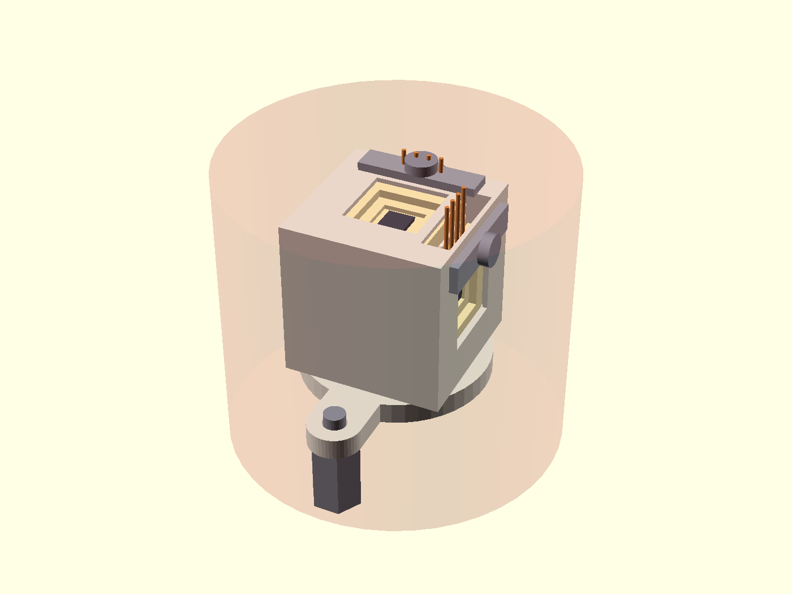
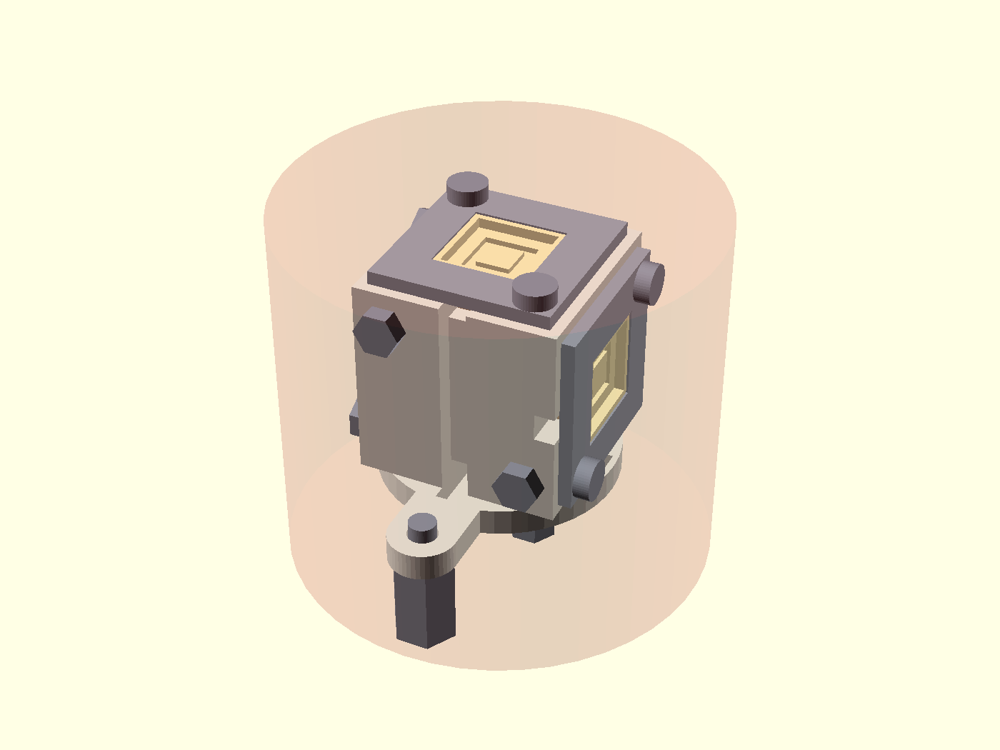
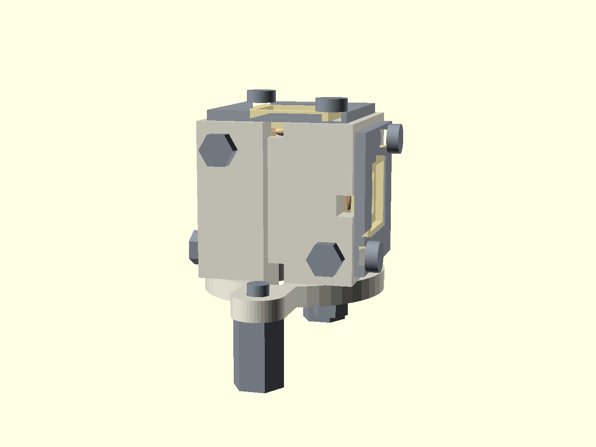
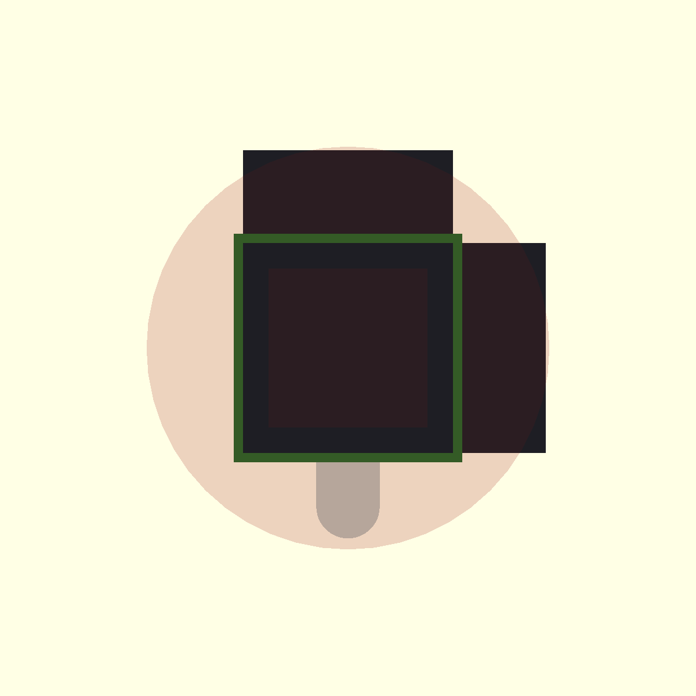
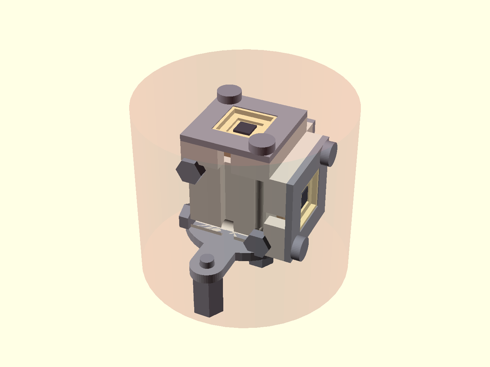

# ST8 — 3D PROBE-HEAD PACKAGING DESIGN (Q8) — concepts, critique, visuals, decision

Designer: packaging-3d-designer · 2026-07-10 · effort HIGH · **DECISION_GATE item**
CAD pipeline used: OpenSCAD 2021.01 (PNG + STL, all four concepts) + build123d 0.11.1
(STEP import of the user's CAD; STEP export of Concepts B and D). Red-team pass pending.

---

## 1. BLUF

**Build Concept B — the "SpringClamp Cube":** a monolithic green-machined **zirconia** cube
(15 mm, integral base flange) with a shallow **drop-in pocket** on three orthogonal faces; in
each pocket a **PEEK insert carrying four gold-plated BeCu leaf springs** contacts the LCC02046's
four mid-side pads (1/6/11/16, per ST7) from below, and a **titanium picture-frame clamp**
(2× Ti M1.6 through-bolts) presses the carrier onto the springs with a **geometry-defined
0.35 mm spring deflection** — preload set by hard stops, not screw torque, so the brittle
carrier cannot be crushed and the retention is fully reversible with no glue anywhere.
It passes every hard constraint with margin (worst corner radius **11.9 mm ≤ 15.875 mm**, stack
height **25.8 mm ≤ 27.5 mm**), it is self-connecting (carrier drops in face-up — **no sliding
over exposed bond wires, ever**), and every carrier is removable/reusable in ~2 minutes with an
M1.6 driver. **Runner-up: Concept D ("TriPlate corner")** — identical contact interface but the
precision pockets live in three small identical zirconia plates on a featureless core cube;
switch to it if the monolithic pocketed cube prices/tolerances badly at the ceramics vendor.
**The user's slotted cube as CAD'd fails the compatibility gate** (no electrical path at all)
and models a 12 × 12 × 0.635 mm plate, not the purchased 8.89 × 8.89 × 1.65 mm LCC02046 — but
his pocket-per-face instinct is sound and survives inside Concept B.

Nothing here touches the Aug-2026 single-axis campaign: the heritage 1D mount stays as-is; this
head is for the 2026-27 vector-probe campaign.

---

## 2. Envelope math (hard constraints, restated numerically)

| Quantity | Value | Basis |
|---|---|---|
| Envelope cylinder | **Ø 31.75 mm × H 27.5 mm**, sitting on the flange face | PACKAGING_3D_ENVELOPE.md §A |
| Allowed radial distance of ANY point from the port axis | **≤ 15.875 mm** | Ø/2 |
| Max axis-aligned cube edge (bare) | a·√2 ≤ 31.75 → **a ≤ 22.45 mm** | geometry |
| Cube edge chosen for B | 15.0 mm → half-diagonal 10.61 mm; worst protruding point (side frame + screw head) **11.87 mm** | echoed by `concept_B.scad` |
| Height budget consumed by B | standoffs 6.5 + base 2.0 + cube 15.0 + frame 1.0 + head 1.3 = **25.8 mm** (margin 1.7 mm) | echoed by `concept_B.scad` |
| Height reserved under the head for the 9C2-275's two Sub-C towers | 6.5 mm nominal, **adjustable via standoff length** — tower protrusion **UNVERIFIED** (ST5 §7, spec PDF unreadable) | ASSUMPTION A2 |

---

## 3. The user's CAD, measured (build123d, real kernel) — and the verdict

Files: `01_MISSION/REFERENCE/cad/new_3d_idea_{assembled,disassembled}.stp`, `old_1d_sensor.stp`.
Renders of his geometry vs the envelope: `user_cad_measured/user_assembled_iso.png`,
`user_cad_measured/user_assembled_top.png`, `user_cad_measured/user_disassembled_iso.png`.

Measured facts (per-solid bounding boxes; all **measured-from-STEP**):

| Solid | Size (mm) | Interpretation |
|---|---|---|
| 69.34 × 69.34 × 16.0 | CF flange model (2.75″ CF OD ≈ 69.9 mm), top face at **z = −6.64** | not part of the package; envelope starts at its top face |
| 20.375 × 31.75 × 3.0 base plate | max vertex radius **15.87 mm** — exactly at the 15.875 mm envelope wall | **zero radial margin** |
| 20 × 15 × 15 head block, z = 3…18 | max vertex radius 12.5 mm ✓; top at 24.64 mm above flange face ✓ | block itself fits |
| 2× internal cavities 4.5 × 14 × 14 | one opens sensor toward −X, one toward +Y; ceilings at z = 17 (1 mm below the top face) → **fully enclosed** when assembled | the block is a **cap lowered over** two plates standing on the base |
| 2× "carrier" plates **12 × 12 × 0.635** + 5 × 5 × 1 "sensor" | **not an LCC02046** (real part: 8.89 × 8.89 × 1.65) | slots don't fit the purchased carrier |
| 2× standoffs 4.72 AF × 9, screws, base hardware at y = ±12.51 | gap under base plate = **6.64 mm** | must clear the Sub-C towers (unverified) |

### Point-by-point critique of the slotted-cube idea (as CAD'd)

| # | Issue | Assessment | Severity |
|---|---|---|---|
| C1 | **No electrical connection anywhere** — the cavity walls touch the plate; nothing touches the 20 castellated pads; no contact elements, no wire channels out of the sealed cavities | **Compatibility-gate FAIL** (§F.1). A friction slot retains a body; it connects nothing. This is the single reason the concept cannot work as drawn | FATAL |
| C2 | **Carrier model is the wrong part**: 12 × 12 × 0.635 mm plate vs the purchased 8.89 × 8.89 × 1.65 mm LCC02046 | every slot dimension must be redone; the 0.635 mm slot logic (thin plate in a wide cavity) doesn't transfer to a 1.65 mm ceramic tile | MAJOR |
| C3 | **Blind assembly over exposed bond wires**: ST7 fixed the carrier as **open-cavity** (no lid — Kovar lid is ferromagnetic). Lowering a closed cap over two standing plates with ~1.4 mm lateral rattle room means unguided walls sweep past unprotected 25 µm Al bond loops | one touch = dead axis, discovered only at first power-up | MAJOR |
| C4 | **No retention**: plates stand loose in 4.5 mm-wide cavities (plate+sensor stack ≈ 1.6 mm) — no lip, spring, or preload in the model. Under HSX vibration the carriers rattle against ceramic walls; for the two horizontal-axis sensors gravity gives zero seating force | chipped castellations, fretting, intermittent contact even if wiring existed | MAJOR |
| C5 | **Slot tolerance vs brittle ceramic + sinter shrinkage**: a slot that grips an 8.89 mm alumina body needs ~0.05–0.1 mm-class clearance; LCC body tolerance is +0.25/−0.13 mm and as-sintered zirconia holds only ~±1 % (±0.09 mm on 9 mm) after ~20 % shrinkage [PC]. A tight slot is either a rattle fit or an interference fit that chips corners — there is no good value | insertion chipping / peeled castellations (the pads ARE the edges being rubbed) | MAJOR |
| C6 | **Thin walls**: the 0.5 mm outer walls (measured) over 14 × 14 mm spans are fragile in the green state, prone to sinter warp, and buy nothing — ceramic is transparent to B-fields, but the wall blocks inspection and encloses the cavity | green-machining scrap rate; virtual-leak-ish enclosed volumes (top gap is only 1 mm ceiling slot) | MODERATE |
| C7 | **Only 2 axes modeled** (sensors face −X and +Y; no Z sensor) | third orthogonal face needed for the vector probe (rsi plan §2.2); top face is available but is also the only assembly opening in his cap-over scheme — direct conflict | MAJOR |
| C8 | **Envelope margins**: base plate at 15.87 mm = the wall, i.e. **zero tolerance**; any real part (±1 % ceramic, or even Ti machining at ±0.1 mm) protrudes. Height OK (24.64 mm). 6.64 mm under-base clearance vs **unverified** Sub-C tower protrusion | fails incoming inspection against the envelope; possible hard interference with the 9C2-275 towers | MODERATE |
| C9 | **6-face vs 3-face**: (question asked in the brief) — only 3 faces are needed; 3 orthogonal axes fully determine **B**. Doubling to 6 buys redundancy/gradiometry but halves wall thickness between opposing pockets, doubles harness count through the same Ø31.75 envelope (24 conductors — exceeds the 18-pin feedthrough), and doubles assembly risk | keep 3 faces; reserve −Z for mounting, −X/−Y for nuts + wire runs | resolved |
| C10 | **What is RIGHT about it** (keep these): pocket-per-face on a single ceramic body; no glue; ambition to make the sensors' dies face outward through defined windows; standoff mounting on the heritage ±12.5 mm pattern; block cross-section (12.5 mm corner radius) comfortably inside the envelope | Concept B deliberately preserves all of this | — |

**Verdict: replace, don't refine.** The load-bearing flaw (C1) is architectural, not parametric —
adding contacts to an enclosed vertical-slot cavity turns it into Concept B anyway. His instinct
(ceramic body, pocket per face, no glue, removable) is exactly Concept B's skeleton.

---

## 4. Interface facts every concept must satisfy (handoffs)

- **Only 4 pads carry signal**: die p1–p4 land on LCC **mid-side pads 1/6/11/16** (one per side,
  pin-1 chamfer as datum) — ST7 §4. Optional guard/shield on 3/8/13/18. No ground on the die.
- **Open cavity, no lid** — die + Al bond wires are exposed on the carrier's top face; nothing
  may touch or sweep over the cavity region (opening 6.10 mm sq; seal-ring band OD 7.98 mm is
  a legitimate clamp land) — ST7 §6 G4/G7.
- Mount provides the **one-exit-per-face harness dressing** (the carrier cannot re-route) — ST7 §5b.
- Below the head: **Accu-Glass 9C2-275** with two vacuum-side Sub-C towers (protrusion
  UNVERIFIED), harness = 2× P/N 100040 9-pin PEEK/Kapton assemblies, cut to length — ST5.
- Carrier body 8.89 sq (+0.254/−0.127) × 1.65; castellations wrap edge→bottom, so the pads are
  contactable **from below** — verified geometry [SS], [TL].

---

## 5. Concepts

Common to all: structure = **yttria-stabilized zirconia** (given). YSZ is the toughest technical
ceramic (K_IC 8–17 MPa·m½), volume resistivity 10¹² Ω·cm (an insulator — **no eddy-current
member near the plates**, unlike any metal head), max use temperature ≥800 °C [PC]; ceramics of
this class are standard non-magnetic UHV materials (zirconia bearings are sold specifically for
UHV service on non-magnetic grounds [CB]; dense technical ceramics do not outgas in UHV [LH]).
Fasteners: **titanium grade 2/5** (non-magnetic, UHV-standard; Accu-Glass sells vented UHV
fastener lines [AG-F], and Ti/Mo UHV fixings are stocked by Allectra/AVA-TEC [AV], NBK [NBK]).
Springs: **gold-plated BeCu C17200** — the standard UHV spring-contact material (Accu-Glass's own
in-vacuum connectors are "UHV-compatible gold-plated beryllium-copper", push-on parts rated
**200 °C, 1×10⁻¹⁰ Torr** [AG-S]); fuzz-button alternates are Au/BeCu wire [CI] with
low-background vacuum-cryostat heritage (Majorana Demonstrator) [MJ].
**Plating rule: gold direct over copper flash — explicitly NO nickel underplate** (Ni is
ferromagnetic; the carrier itself was bought "no-Ni" for this reason [SS]).

---

### Concept A — "Refined slotted cube + flying leads" (the user's idea made honest; §F seed S4)

Folder: `concept_A_slot_refined/` — `concept_A.scad`, `concept_A_iso.png`, `concept_A_top.png`,
`concept_A_front.png`, `concept_A_section.png`, `concept_A.stl`

| Attribute | Design |
|---|---|
| Retention | Open-front vertical slot per face (top-loading); carrier rides on two edge rails touching only the outer 0.9 mm rim of its **front** face; a **BeCu bow spring** behind the carrier preloads it against the rails (~1–2 N); **Ti keeper strip** (1× M1.6) closes the slot mouth |
| Electrical (gate §F.1) | **Not in the mount.** Four 34 AWG Kapton-insulated flying leads are attached to castellations 1/6/11/16 **before insertion** (vacuum-grade solder or parallel-gap weld) and exit through the slot mouth to the harness. Carrier is mechanically reusable; the lead joint is semi-permanent → **only partial pass** |
| Insert / remove | (1) attach leads on the bench; (2) slide carrier down the rails, die facing OUT through the 7.0 mm window (never facing a wall); (3) fit keeper. Reverse to remove |
| Envelope | cube 15 mm: corner radius 10.61 mm ✓; stack 25.0 mm ✓ (echoed in the .scad) |
| Zirconia manufacturability | worst of the four: slots + rails + windows = thin green-state webs; rails must hold ~±0.1 mm across sinter → needs post-sinter diamond dressing of the rail faces [PC] |
| Bond-wire safety | better than the user's (die faces out, slide direction is parallel to the die plane, window rails touch only the rim) but the carrier still **slides** 12 mm on its pad rim |
| Failure mode if built | solder wick / flux in UHV, magnetic Sn-Ni risk at the joints (ST7 rejected carrier-level jumpers for exactly this); slide-in chipping of castellation edges; leads fatigue at the slot mouth |

**Role: honest baseline.** It quantifies what the slot idea costs: the electrical problem gets
pushed into solder-on-castellations, which ST7 already rejected on the carrier. Not recommended.

---

### Concept B — "SpringClamp Cube" (S1 + S2 hybrid) — **RECOMMENDED**

Folder: `concept_B_springclamp_cube/` — `concept_B.scad`, `concept_B.py`, `concept_B_iso.png`,
`concept_B_top.png`, `concept_B_front.png`, `concept_B_section.png`, `concept_B.stl`,
`concept_B.step` (zirconia body + 3 Ti frames, re-import verified), `concept_B_zirconia_body.stl`

| Attribute | Design |
|---|---|
| Structure | ONE monolithic zirconia part: 15 mm cube + integral Ø18 × 2 base flange with two ear tabs on the heritage ±12.5 mm standoff pattern (measured from `old_1d_sensor.stp`). Two Ti hex standoffs (length = tower clearance, trimmed by spacers) |
| Retention | Per face (+X, +Y, +Z): drop-in pocket **9.40 sq × 2.15 deep** (LCC max body 9.14 + 0.26 for as-sintered ±1 % tolerance — spring compliance absorbs the rest); carrier sits **proud by 0.50 mm**; **Ti grade-2 picture frame** 13.4 sq × 1.0, window 7.0 sq, lands **flush on the ceramic face** and its inner land depresses the carrier 0.35 mm against the springs. Preload is set by geometry (hard stop), NOT torque → a ham-fisted screwdriver cannot crack the carrier. 2× **Ti M1.6 through-bolts** per frame to hex nuts on the opposite bare faces (all six bolt lines at distinct offsets 4.95–5.20 mm so none intersect inside the cube; +Z pair continues through the base flange = also the cube's own clamp path) |
| Electrical (gate §F.1) | **PEEK contact insert** 9.3 sq × 1.0 in the pocket floor carries **four photo-etched, formed BeCu C17200 leaf springs, gold over copper flash (NO nickel)**, one under each **mid-side bottom pad (1/6/11/16)** — the castellation wraps under the body, so contact is on the flat bottom pad, the gentlest possible spot. Finger: ~1.5 w × 0.10 t × 3.5 mm cantilever → k ≈ 1.3 N/mm, 0.35 mm working deflection → **~0.45 N (≈45 gf) per contact**, in the standard range for reliable gold-gold contact (ENGINEERING JUDGMENT; consistent with Au/BeCu button practice [CI]). Peak bending stress ~550 MPa vs ≥1000 MPa yield for aged C17200 — safe. Each finger's tail exits through the insert's back window into the face wire-groove and is **crimped or push-on-connected** (Accu-Glass Au/BeCu push-on, 200 °C, 1×10⁻¹⁰ Torr [AG-S]) to a conductor of the cut-to-length 100040 assembly — **no solder anywhere in the vessel** |
| Optional shield | duplicate fingers at 3/8/13/18 tied to the harness drain per ST6/ST7 guard option (insert has room; leave unpopulated by default) |
| Bond-wire safety | carrier is **placed face-up, straight down** — zero sliding; the frame window (7.0 sq) clears the cavity opening (6.10 sq) and bears only on the rim/seal-ring band (bearing stress ≈ 2 N / 21 mm² ≈ **0.1 MPa**, vs >2 GPa ceramic compressive strength — 4 orders of margin) |
| Insert / remove (per carrier, ~2 min) | (1) drop carrier in, chamfer to the engraved pin-1 mark; (2) place frame; (3) run in 2× M1.6 until the frame seats flush (torque uncritical); (4) done — contacts made. Removal: reverse; springs self-wipe on every cycle (fresh gold interface each install) |
| Envelope (echoed by .scad + asserted in .py) | worst corner (side frame + screw head): **11.87 mm ≤ 15.875**; ears: 15.0 mm (0.875 margin); stack: **25.8 ≤ 27.5 mm** |
| Harness | per face, 4 conductors leave through a 2.0 × 1.5 green-machined groove, run down the bare −X/−Y face grooves to the bottom radial grooves → Ø5 center hole through the base → split to the two Sub-C towers (2× 100040, 9-pin: sensor A pairs + shields on tower 1, sensors B/C split per ST6's pin plan). Ti wire clip under the base = strain relief; wires never bend tighter than 5× diameter |
| Zirconia manufacturability | one green-machined part: flat-bottom pockets, through-holes, open surface grooves — all standard green-CNC features; **no closed cavities, no threads in ceramic, no thin webs** (minimum wall 2.5 mm at pocket margins, 1.5 mm at bolt holes). As-sintered ±1 % is ACCEPTABLE EVERYWHERE because the spring stack absorbs ±0.15 mm — **no post-sinter diamond grinding required** except optionally the three pocket floors. Vendor class: technical-ceramics job shops quoting green-machined YSZ (e.g., Precision Ceramics [PC]; equivalent: CoorsTek, Ortech, Superior Technical Ceramics). Fired dimensions are in `concept_B.step`; vendor applies their lot shrinkage (~20 % [PC]) |
| Thermal | ΔCTE(YSZ 10.5, alumina ~7, Ti ~8.6 ppm/K) over 9 mm and 150 °C ≈ 4 µm — absorbed by the 350 µm spring deflection. PEEK insert: in-system precedent — the vacuum-side connectors are already PEEK rated 250 °C / 1×10⁻¹⁰ Torr [AG-40]. BeCu springs: Accu-Glass rates its BeCu push-ons to 200 °C in UHV [AG-S]; above ~200 °C sustained, BeCu stress-relaxes — see flip condition |
| Vibration | carrier mass ≈ 0.5 g; 1.8 N nominal preload → holds >350 g acceleration before unloading; leaf contacts maintain force through the whole deflection band (0.2–0.5 mm) |
| Failure mode if wrong | a mis-formed finger gives an open channel — **detectable in 30 s with a bench continuity fixture before the vessel closes** (test point: DSUB side). Mitigation: acceptance-test every insert; carry 2 spare populated inserts (they are 9 × 9 mm PEEK parts) |

**Why it wins:** it is the only concept that simultaneously (i) makes all four contacts
automatically on assembly with no solder/glue, (ii) never slides or shocks the brittle body
(place-and-clamp, torque-independent preload), (iii) tolerates as-sintered zirconia tolerances
without diamond grinding, and (iv) keeps every serviceable part (springs, insert, frame, screws)
a COTS-or-photoetch metal/plastic part while the ceramic stays one simple block.

---

### Concept C — "COTS LCC-20 socket per face" (§F seed S3) — screened and **REJECTED**

Folder: `concept_C_cots_socket/` — `concept_C.scad`, `concept_C_iso.png`, `concept_C_top.png`,
`concept_C_front.png`, `concept_C_section.png`, `concept_C.stl`

Screening result against the three hard gates (generic Aries/Plastronics-class LCC-20 open-top
burn-in socket, ~16.5 mm sq × ~7 mm + a mounting PCB):

| Gate | Finding | Verdict |
|---|---|---|
| Non-magnetic | Aries specifies socket contacts as heat-treated BeCu with Au **over 0.75 µm min nickel** per QQ-N-290 [AR] — nickel underplate is ferromagnetic; industry-standard for the whole socket class (Plastronics is the same market [PL]) | **FAIL** |
| Envelope | model echo: side-socket corner radius **17.6 mm > 15.875** and stack 29.6 > 27.5 mm, even on a minimal 14 mm cube — and each socket still needs a PCB to be soldered to | **FAIL** |
| UHV / temperature | burn-in socket bodies are glass-filled PPS/LCP, unrated for outgassing; ratings top out at +150 °C [AR]; PCB (FR4/polyimide + ENIG = more Ni) adds outgassing and magnetics | **FAIL** |

No COTS LCC-20 socket survives any single gate, let alone all three. Value of the exercise: it
confirms the **contact principle** (spring fingers on castellation pads, thousands of cycles) that
Concept B implements in UHV-legal materials. REJECT — no further work.

---

### Concept D — "TriPlate corner" — **RUNNER-UP**

Folder: `concept_D_triplate_corner/` — `concept_D.scad`, `concept_D.py`, `concept_D_iso.png`,
`concept_D_top.png`, `concept_D_front.png`, `concept_D_section.png`, `concept_D.stl`,
`concept_D.step` (core + 3 plates + Ti base, re-import verified), `concept_D_seat_plate.stl`

Identical carrier interface to B (PEEK insert + 4 Au/BeCu leaf springs + Ti clamp frame +
geometry-defined preload). The difference is **where the precision lives**:

| Attribute | Design |
|---|---|
| Structure | featureless **12 mm zirconia core cube** (through-holes + 2 wire grooves only) + **three IDENTICAL flat zirconia seat plates** 13.4 sq × 3.2 (through-window pocket, 2 holes, wire notch) bolted to +X/+Y/+Z; Ti base flange; the +Z plate's M2 bolt pair continues through core AND base — one bolt pair clamps plate+cube+base |
| Why it exists | the ONLY nontrivial ceramic features are in small flat plates — the cheapest possible zirconia parts (green-machine, or diamond-grind from standard YSZ plate stock); order 10, keep spares; a chipped pocket costs a plate, not the whole head. Core cube is trivially green-machinable |
| Envelope (echoed + asserted) | worst corner 13.31 ≤ 15.875 mm; stack 25.5 ≤ 27.5 mm — fits, with less radial margin than B (plates stand off the core) |
| Costs vs B | 4 ceramic parts + 1 Ti part instead of 1 ceramic part → orthogonality now depends on bolted joints (±0.2–0.5° face-to-face vs "as-fired one-piece" for B; absorbed by vector calibration but a real error term); ~8 more fasteners; two more part numbers; assembly sequence matters (plates on before harness) |
| Failure mode if wrong | joint micro-slip under thermal cycling shifts axis alignment between calibrations — shows up as slow drift in the reconstructed field direction |

**Flip TO D if:** the ceramics vendor quotes the monolithic pocketed cube at >2–3× the plate
set, can't hold the pocket tolerances as-sintered, or the lead time breaks the schedule.

---

## 6. Weighted decision matrix

Weights (sum 100): electrical-contact reliability **25**, carrier survival (brittle body,
bond wires) **20**, envelope margin + true 3-axis orthogonality **15**, non-magnetic/UHV
compliance **15**, zirconia manufacturability **10**, assembly/service ease **8**,
harness integration **4**, cost/schedule **3**. Scores 1–5 (5 best).

| Criterion (wt) | A slot+leads | **B SpringClamp** | C COTS socket | D TriPlate |
|---|---|---|---|---|
| Contact reliability (25) | 2 (solder joints, rework) | **5** (self-wiping springs, testable) | 4 (proven contacts…) | **5** |
| Carrier survival (20) | 2 (slide-in on pad rims) | **5** (drop-in, torque-independent preload) | 4 | **5** |
| Envelope + orthogonality (15) | 4 | **5** (11.9/15.9 mm, one-piece axes) | 1 (17.6 mm — FAIL) | 4 |
| Non-magnetic / UHV (15) | 3 (solder+flux in vessel) | **5** (Au/BeCu no-Ni, PEEK, Ti, YSZ) | 1 (Ni plating — FAIL) | **5** |
| Zirconia manufacturability (10) | 2 (rails, thin webs) | 4 (one part, green-CNC only) | 3 (cube trivial, moot) | **5** (flat plates) |
| Assembly / service (8) | 2 | **5** (2 screws per carrier) | 5 (latch, moot) | 4 |
| Harness integration (4) | 3 (leads exit slot mouths) | **5** (grooves → center hole) | 2 | 4 |
| Cost / schedule (3) | 4 | 3 | 2 | 4 |
| **Weighted total (100)** | **2.55** | **4.84** | **2.94** | **4.70** |

(A: 2(.25)+2(.20)+4(.15)+3(.15)+2(.10)+2(.08)+3(.04)+4(.03) = 2.55; B = 4.84; C = 2.94 — but C
carries two hard-gate FAILs, which disqualify it regardless of score; D = 4.70.)

---

## 7. Recommendation

- **Build Concept B (SpringClamp Cube).** Freeze the interface now: pocket 9.40 sq × 2.15,
  carrier proud 0.50, spring deflection 0.35 mm, frame window 7.0 sq, contacts on pads
  1/6/11/16 (+ optional 3/8/13/18 shield), harness exits per §5-B. `concept_B.step` is the
  vendor handoff geometry (fired dims).
- **Runner-up: Concept D** — same electrical interface (the PEEK insert + springs + frame are
  IDENTICAL parts), so the choice between B and D is purely a ceramics-procurement decision and
  can be made after the first vendor quote **without touching anything else**.
- **Flip conditions:**
  1. B→D: monolithic cube quote >2–3× the plate set, unachievable as-sintered pocket tolerance,
     or lead time > the vector-probe integration date.
  2. Springs: if HSX in-vessel temperature at the probe exceeds ~200 °C sustained (BeCu
     relaxation; Accu-Glass BeCu push-on rating 200 °C [AG-S]), change contact element to
     **Au/BeCu fuzz buttons** (shorter columns, less stress-relaxation sensitivity [CI][MJ]) or
     Ti/Paliney fingers — the PEEK insert pocket accepts either without ceramic changes
     (PEEK itself is rated 250 °C in this system [AG-40]).
  3. If the 9C2-275 Sub-C towers protrude >~10 mm (spec PDF still unread — ST5), the standoff
     budget collapses → escalate the ST5 flip to the 4.5″ CF / 15D-450 path before ceramics PO.
- **Decision-gate items for the user:** (i) approve Concept B geometry freeze; (ii) approve
  ordering 1 zirconia body + 6 frames + 4 populated inserts (2 spares); (iii) confirm tower
  protrusion with Accu-Glass before fixing standoff length.

## 8. Zirconia manufacturing notes (for the RFQ)

1. Green-machine YSZ (3Y-TZP), sinter, no HIP needed; vendor scales green blank by lot
   shrinkage ~20 % [PC]. All features are green-CNC-able: flat pockets, Ø1.8 through-holes
   (≥1.5 mm wall), open 2.0 × 1.5 grooves, Ø5 base hole.
2. Tolerances: ±1 % as-sintered everywhere is acceptable **by design** (spring compliance
   0.2–0.5 mm working band). Optionally diamond-lap the three pocket floors flat to 0.02 mm
   if the vendor offers it cheaply — improves preload uniformity, not required.
3. No threads in ceramic, ever; all threads live in Ti nuts/standoffs. Chamfer all pocket
   and hole edges 0.2 mm in green state (chip prevention).
4. Deliverables to vendor: `concept_B.step` (fired dims) + note "scale by measured lot
   shrinkage; critical faces: 3 pocket floors, base flange plane."

## 9. Assumptions made (orchestrator: log to 05_STATE/ASSUMPTIONS.md — ST8 does not write there)

1. **A1**: Envelope cylinder is centered on the head-block axis; his base plate center is
   offset (x ≈ +5.7 mm) — I centered all concepts on the port axis.
2. **A2**: Sub-C tower protrusion ≤ ~6.5 mm and towers sit near the flange bore edge (his CAD
   shows a 6.64 mm under-base gap) — **UNVERIFIED**; standoff length is the adjustable variable.
3. **A3**: Head mounts via two standoffs on the heritage ±12.5 mm pattern (measured in
   `old_1d_sensor.stp`); actual tapped features on the HSX-side flange **UNVERIFIED**.
4. **A4**: Contact force 0.3–0.6 N/contact suffices for stable gold-gold contact at 100 µA
   (ENGINEERING JUDGMENT, standard practice; not datasheet-verified for a custom finger).
5. **A5**: Spring-finger stress/stiffness numbers are first-order cantilever estimates; final
   finger geometry needs a bench force-deflection check on the photo-etch prototypes.
6. **A6**: In-vessel temperature at the probe head ≤ ~200 °C during operation/bake (drives
   flip condition 2). HSX-side confirmation needed.
7. **A7**: LCC02046 castellation pads wrap to the package bottom with enough flat area
   (~0.6 × 0.6 mm) for a leaf contact — consistent with the drawing and the standard 0.350″
   LCC outline [SS][TL]; confirm on a physical part before finalizing finger tip position.
8. **A8**: COTS socket dimensions in Concept C are generic class values (16.5 sq × 7 mm) for
   the violation demonstration — exact P/N dims vary but no LCC-20 socket class is smaller
   than the gates require; the Ni-plating kill is P/N-independent [AR].

## 10. Files produced (this run)

| Path | Content |
|---|---|
| `user_cad_measured/` | `view_user.scad`, `user_assembled.stl`, `user_disassembled.stl`, `user_assembled_iso.png`, `user_assembled_top.png`, `user_disassembled_iso.png` |
| `concept_A_slot_refined/` | `.scad` + 4 PNG + `.stl` |
| `concept_B_springclamp_cube/` | `.scad`, `.py` + 4 PNG + `.stl`, `.step` (re-import verified), `concept_B_zirconia_body.stl` |
| `concept_C_cots_socket/` | `.scad` + 4 PNG + `.stl` |
| `concept_D_triplate_corner/` | `.scad`, `.py` + 4 PNG + `.stl`, `.step` (re-import verified), `concept_D_seat_plate.stl` |

CAD tooling log: OpenSCAD 2021.01 at `C:\Program Files\OpenSCAD\openscad.exe` — all PNG/STL;
build123d 0.11.1 — STEP import (user CAD, per-solid measurement) and STEP export (B, D). No
fallbacks needed; harmless font warnings on build123d stderr ignored (pre-patched).

## Sources

- [SS] Spectrum Semiconductor LCC02046 (0.350″ sq, 20 pads 0.050″, "NON-MAGNETIC / NO NI"):
  https://www.spectrum-semi.com/products/leadless-chip-carrier
- [TL] TopLine LCC20 geometry cross-check: https://www.topline.tv/lcc.html
- [PC] Precision Ceramics — Zirconia (sinter shrinkage ~20 %; green vs diamond machining;
  K_IC 8–17 MPa·m½; max use temp; 10¹² Ω·cm): https://precision-ceramics.com/materials/zirconia/
- [LH] Louwers Hanique — glass/ceramic materials in UHV (no outgassing under UHV):
  https://www.louwershanique.com/news-events/glass-and-ceramic-materials-in-ultra-high-and-ultra-clean-vacuum
- [CB] Carter Bearings — zirconia/Si₃N₄ UHV bearings, non-magnetic:
  https://www.carterbearings.co.uk/industries/ultra-high-vacuum/
- [AG-S] Accu-Glass specialty connectors — UHV gold-plated BeCu, push-on 200 °C / in-line
  400 °C, 1×10⁻¹⁰ Torr: https://www.accuglassproducts.com/specialty-connectors
- [AG-40] Accu-Glass 100040 9-pin PEEK/Kapton vacuum-side assembly (250 °C, 1×10⁻¹⁰ Torr, ST5):
  https://www.accuglassproducts.com/subminiature-c/uhv-round-cables/9-pin-female-connector-cable
- [AG-F] Accu-Glass vented UHV fasteners catalog PDF:
  https://www.accuglassproducts.com/sites/default/files/catalog/vented_uhv_fasteners.pdf
- [AV] AVA-TEC / Allectra — UHV titanium & molybdenum fixings (M1–M2 on request):
  https://avactec.es/en/uhv-and-hv-compatible-titanium-and-molybdenum-fixings/
- [NBK] NBK titanium screws (non-magnetic, vacuum lines):
  https://www.nbk1560.com/en-US/products/specialscrew/nedzicom/titaniumscrew/
- [AR] Aries Electronics — test-socket contact materials: heat-treated BeCu, 0.75 µm Au **over
  0.75 µm Ni** per SAE AMS-QQ-N-290, −55…+150 °C (class spec used for the C rejection):
  https://www.arieselec.com/product/23023-csp-test-socket/ (materials block; same spec family
  across Aries LCC/CSP sockets)
- [PL] Plastronics / Smiths Interconnect burn-in & test sockets (LCC/PLCC open-top class):
  https://www.test-socket.com/Plastronics.html
- [CI] Custom Interconnects — Fuzz Buttons, Au/BeCu wire contacts + technical data:
  https://www.custominterconnects.com/fuzzbuttons.html ,
  https://www.custominterconnects.com/technicaldata.html
- [MJ] Majorana Demonstrator — low-background cables/connectors (fuzz-button interconnects in
  an ultra-clean vacuum cryostat): https://arxiv.org/pdf/1712.04985
- Internal: ST7 `70_PACKAGING/PACKAGING_REVIEW.md` (pads 1/6/11/16, open cavity, mount-level
  routing); ST5 `50_FLANGE/FLANGE_SELECTION.md` (9C2-275, 100040, tower protrusion UNVERIFIED);
  `01_MISSION/REFERENCE/PACKAGING_3D_ENVELOPE.md`; user STEP files (measured this run).
